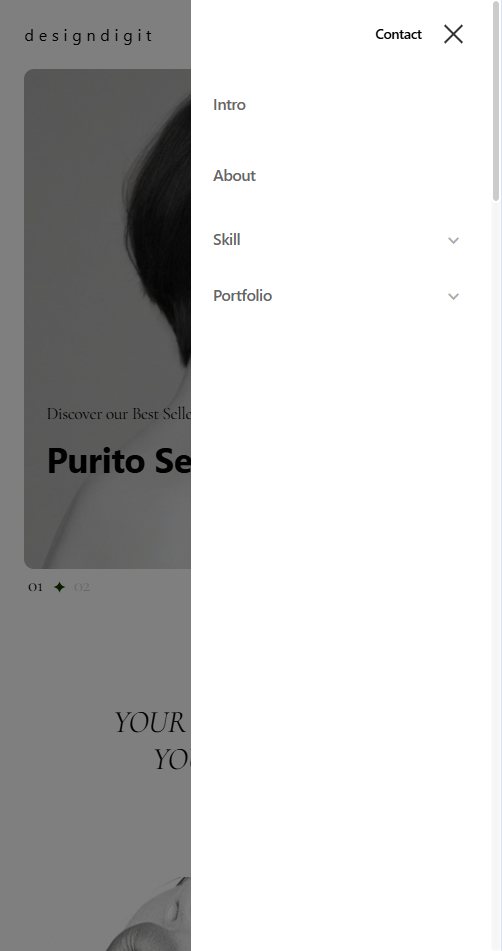
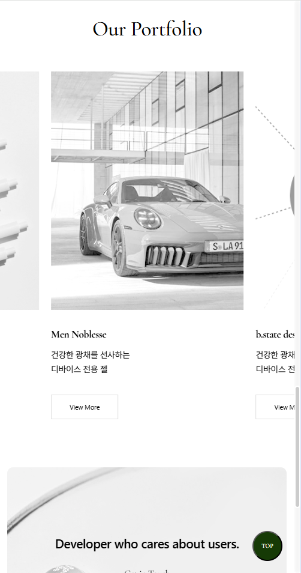

# Purito Seoul

</br>

### 🔍 주요특징
* GSAP 애니메이션
강력한 애니메이션 라이브러리: GSAP을 사용하여 부드럽고 복잡한 애니메이션을 구현합니다.</br>
ScrollTrigger: 스크롤에 따른 애니메이션 효과를 쉽게 설정할 수 있습니다.

* 반응형 디자인
디바이스 체크: 화면 크기에 따라 모바일과 데스크탑에서 다른 애니메이션 및 UI 동작을 적용합니다.</br>
창 크기 변경에 대한 대응: 사용자가 창 크기를 조절할 때 UI가 자동으로 업데이트됩니다.

* 사용자 경험 향상
메뉴 인터랙션: 메뉴 탭 클릭, 배경 클릭으로 메뉴 열기/닫기 기능을 제공합니다.</br>
커스텀 커서: 마우스 위치에 따라 커서가 부드럽게 움직이며 시각적인 재미를 더합니다.

* 부드러운 스크롤
Lenis 라이브러리 사용: 스크롤을 부드럽게 만들어 사용자 경험을 개선합니다.

* 이벤트 기반 UI
다양한 이벤트 리스너: 마우스 이동, 클릭, 스크롤 등 다양한 사용자 상호작용을 처리합니다.</br>
클래스 토글: 특정 요소에 클래스를 추가하거나 제거하여 상태를 관리합니다.

* 모듈화
재사용 가능한 코드: 함수와 이벤트 리스너를 사용하여 코드가 모듈화되어 있어 유지보수가 용이합니다.

</br>

### 🛠️ 사용 기술


      

</br>

### ⚙️ 기능 상세 설명

### 🌀 1. GSAP 애니메이션
- 스크롤 시 특정 요소에 active 클래스를 추가하여 애니메이션 효과를 주는 코드입니다.


 ``` JavaScript
	gsap.utils.toArray(".scale-ani").forEach(function(item) {
	    gsap.timeline({
	        scrollTrigger: {
	            trigger: item,
	            start: "top bottom",
	            end: "bottom top",
	            onEnter: function() {
	                item.classList.add("active");
	            },
	            onLeave: function() {
	                item.classList.remove("active");
	            },
	            onLeaveBack: function() {
	                item.classList.remove("active");
	            }
	        }
	    });
	});
```

---

</br>

### 🌀 2. 반응형 디자인
- 창 크기를 체크하여 데스크탑인지 모바일인지 판단합니다. 메뉴 상태를 초기화합니다.

``` JavaScript
	function checkWindowSize() {
	    let winw = window.innerWidth;
	    desktopFlag = winw >= 1240;
	
	    if (header.classList.contains("menu-open")) {
	        header.classList.remove("menu-open");
	    }
	}
```
---

</br>

### 🌀 3. 사용자 경험 향상
- 메뉴 탭 클릭 시 메뉴의 열림/닫힘 상태를 전환합니다. 사용자에게 직관적인 인터페이스를 제공합니다.


 ``` JavaScript
	menuTab.addEventListener("click", function(e) {
	    e.preventDefault();
	    header.classList.toggle("menu-open");
	});
```

---

</br>

### 🌀 4. 부드러운 스크롤


- Lenis 라이브러리를 사용하여 부드러운 스크롤 효과를 설정합니다.

 ``` JavaScript
	const lenis = new Lenis({
	    duration: 2,
	    easing: (t) => Math.min(1, 1.001 - Math.pow(2, -10 * t))
	});
```

---

</br>

### 🌀 5. 이벤트 기반 UI
- 마우스 이동에 따라 커서가 부드럽게 이동하는 애니메이션을 구현합니다.


 ``` JavaScript
	document.body.addEventListener("mousemove", function(e) {
	    gsap.to("#custom-cursor", {
	        x: e.clientX,
	        y: e.clientY,
	        duration: 1.2,
	        ease: Power3.easeOut
	    });
	});
```

---

</br>

### 📱 모바일 반응형 이미지

| 모바일 메인페이지 | 모바일 메뉴 | 모바일 스와이퍼 |
|------------------|------------|-------------|
|  |  |  |

</br>

### 🧾 View
https://purito-seoul.vercel.app/